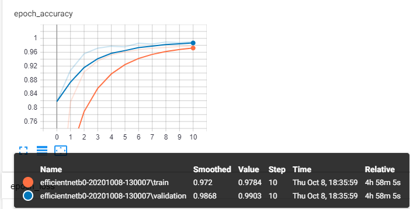
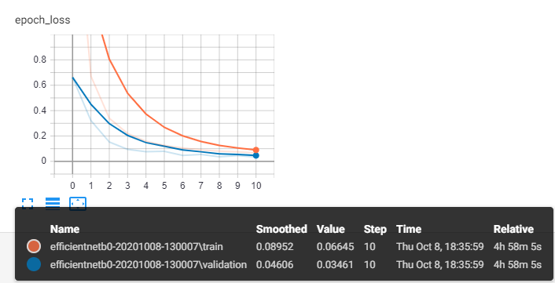

# Action recognition from video with EfficientNet models
[](https://github.com/vincenzosantopietro/action-recognition-efficientnet/blob/master/LICENSE)
[](https://github.com/vincenzosantopietro/action-recognition-efficientnet/issues)
[](https://github.com/vincenzosantopietro/action-recognition-efficientnet/pulls)

[](https://www.python.org/)


This repository contains an action recognition project with the new EfficientNetB<0,1,2,3,4,5,6,7> Convolutional Neural Networks recently integrated in the tf.keras.application module.
The dataset used for this experiment is UCF101. 
The image_dataset_from_directory routine is used and this is only available in tf-nightly module at the moment.
While training, the network stores the best weights in a dedicated folder, as well as logs that can be visualized through TensorBoard.

I've also added the weights of an EfficientNetB0 model i've trained that you can use by yourself for inference.
 
## Environment
The yaml file exported from my conda environment is available in the repository for the sake of reproducibility.  
```shell script
    cd resources
    conda env create -f environment.yml
    conda activate aiml
```
## Dataset
As sample, I've used the UCF101 dataset (https://www.crcv.ucf.edu/data/UCF101.php) from the UCF Center for Research in Computer Vision. The dataset you'll find in the resources folder has already been pre-processed and balanced.


Each image has shape (320,240,3) but I had to reduce the size to be able to train the EfficientNet model due to lack of memory on my GPU. (If you're reading this and you're rich, please buy me a new GPU :) )

## Train your network
You can easily start the training process of your favourite EfficientNet model with the following command.

```shell script
    python main.py --batch_size 32 --epochs 10 --efficientnet_id 0
```

This will create an EfficientNetB0 model and train it on the UCF101 dataset. This action recognition task is not so hard to learn. You can expect high scores pretty soon (accuracy greater than 80% in less than 5 epochs).
 
The training time depends on your hardware infrastructure: on my "poor" Nvidia GTX 1080 8GB it takes a couple of hours or so to complete a few epochs but i'm limited to small batch sizes. Why ? Because if I increase it I get an a Resources Exhausted Exception. By the way, if you have more memory on your GPU you won't have any trouble.

## Infererence on a sample video
This is under development

## TODO 💥
 - Inference script on custom video file
 - Support for Webcam 
 - Add tests
 - Add table with results in the README
